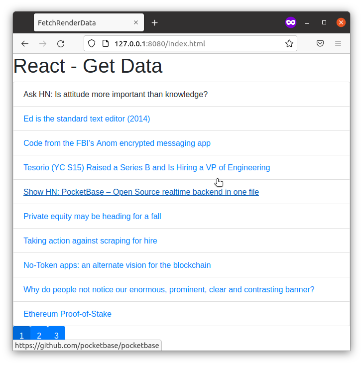

# FetchRenderData
Fetch And Render Data Repository for xPro course

Description: This is an exercise in using REACT to how to fetch, manipulate, and render data from an external source with the following features:
-Data is fetched via the Hacker News API ( https://hn.algolia.com/api/ )
-The data displapyed are titles of articles on the front page, along with links if the URL was available in the fetched data. The listing is sorted by newest first.
-The display includes pagination: buttons will appear at the bottom so that a maximum of 10 article titles are displayed on each page. This of course depends on the number of titles/URLs returned by the query ( "https://hn.algolia.com/api/v1/search_by_date?tags=front_page" ).

Usage: 
1. Download/copy the files and folders to a local folder. 
2. If using Node.js, open the command line point to the root folder of the target files, for example "cd path/to/ToDoList". 
3. Then run "npm install" to install all dependencies, and then run "http-server ./public" to start the server. 
4. Then view the page by navigating to the following URL in a web browser: "http://127.0.0.1:8080/index.html" (default IP address and port number is shown). 

The output should include the following:
-A listing of articles on the Hacker News front page, each of which is a link to the respective article.
-Buttons for changing pages, with a maximum of 10 article titles displayed on one page.
The output should look like this:
 

Roadmap: This exercise can be improved in the future by adding features for the listing (such as listing number and alternate row colors), and a search feature which will take user input to dynamically create the query to fetch data.

License: MIT License (NOTE: significant parts of this code was taught and/or provided via the MIT xPRO course in Full Stack Development, and I do not claim ownership over it)

Permission is hereby granted, free of charge, to any person obtaining a copy
of this software and associated documentation files (the "Software"), to deal
in the Software without restriction, including without limitation the rights
to use, copy, modify, merge, publish, distribute, sublicense, and/or sell
copies of the Software, and to permit persons to whom the Software is
furnished to do so, subject to the following conditions:

The above copyright notice and this permission notice shall be included in all
copies or substantial portions of the Software.

THE SOFTWARE IS PROVIDED "AS IS", WITHOUT WARRANTY OF ANY KIND, EXPRESS OR
IMPLIED, INCLUDING BUT NOT LIMITED TO THE WARRANTIES OF MERCHANTABILITY,
FITNESS FOR A PARTICULAR PURPOSE AND NONINFRINGEMENT. IN NO EVENT SHALL THE
AUTHORS OR COPYRIGHT HOLDERS BE LIABLE FOR ANY CLAIM, DAMAGES OR OTHER
LIABILITY, WHETHER IN AN ACTION OF CONTRACT, TORT OR OTHERWISE, ARISING FROM,
OUT OF OR IN CONNECTION WITH THE SOFTWARE OR THE USE OR OTHER DEALINGS IN THE
SOFTWARE.
